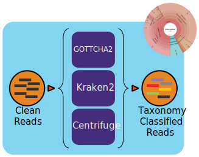

:github_url: https://github.com/microbiomedata/ReadbasedAnalysis/blob/master/docs/index.rst

..
   Note: The above `github_url` field is used to force the target of the "Edit on GitHub" link
         to be the specified URL. That makes it so the link will work, regardless of the Sphinx
         site the file is incorporated into. You can learn more about the `github_url` field at:
         https://sphinx-rtd-theme.readthedocs.io/en/stable/configuring.html#confval-github_url

The Read-based Taxonomy Classification (v1.0.10)
================================================

Workflow Overview
-----------------
The pipeline takes in a Illumina sequencing file (single- or paired-end) or PacBio sequencing file and profiles them using multiple taxonomic classification tools with the Cromwell as the workflow manager.

Workflow Availability
---------------------
The workflow is available in GitHub: https://github.com/microbiomedata/ReadbasedAnalysis; the corresponding Docker image is available in DockerHub: 

- `microbiomedata/nmdc_taxa_profilers <https://hub.docker.com/r/microbiomedata/nmdc_taxa_profilers>`_

Requirements for Execution:  
~~~~~~~~~~~~~~~~~~~~~~~~~~~

(recommendations are in **bold**)

- WDL-capable Workflow Execution Tool (**Cromwell**)
- Container Runtime that can load Docker images (**Docker v2.1.0.3 or higher**)

Hardware Requirements:
~~~~~~~~~~~~~~~~~~~~~~
- Disk space: 152 GB for databases (55 GB, 89 GB, and 8 GB for GOTTCHA2, Kraken2 and Centrifuge databases, respectively)
- 60 GB RAM

Workflow Dependencies
---------------------

Third party software:
~~~~~~~~~~~~~~~~~~~~~

(These are included in the Docker image.)

- `GOTTCHA2 v2.1.8.5 <https://github.com/poeli/GOTTCHA2>`_  (License: `BSD-3-Clause-LANL <https://github.com/poeli/GOTTCHA2/blob/master/LICENSE>`_)
- `Kraken2 v2.1.2 <http://ccb.jhu.edu/software/kraken2>`_ (License: `MIT <https://github.com/DerrickWood/kraken2/blob/master/LICENSE>`_)
- `Centrifuge v1.0.4 <http://www.ccb.jhu.edu/software/centrifuge>`_ (License: `GPL-3 <https://github.com/DaehwanKimLab/centrifuge/blob/master/LICENSE>`_)

Requisite databases:
~~~~~~~~~~~~~~~~~~~~

The database for each tool must be downloaded and installed. These databases total 152 GB.

- GOTTCHA2 database (gottcha2/):

The database RefSeqr90.cg.BacteriaArchaeaViruses.species.fna contains complete genomes of bacteria, archaea and viruses from RefSeq Release 90. The following commands will download the database:

::

    wget https://edge-dl.lanl.gov/GOTTCHA2/RefSeq-r90.cg.BacteriaArchaeaViruses.species.tar
    tar -xvf RefSeq-r90.cg.BacteriaArchaeaViruses.species.tar
    rm RefSeq-r90.cg.BacteriaArchaeaViruses.species.tar

- Kraken2 database (kraken2/):

This is a standard Kraken 2 database, built from NCBI RefSeq genomes. The following commands will download the database:

::

    mkdir kraken2
    wget https://genome-idx.s3.amazonaws.com/kraken/k2_standard_20201202.tar.gz
    tar -xzvf k2_standard_20201202.tar.gz -C kraken2
    rm k2_standard_20201202.tar.gz

- Centrifuge database (centrifuge/):

This is a compressed database built from RefSeq genomes of Bacteria and Archaea. The following commands will download the database:

::

    mkdir centrifuge
    wget https://genome-idx.s3.amazonaws.com/centrifuge/p_compressed_2018_4_15.tar.gz 
    tar -xzvf p_compressed_2018_4_15.tar.gz -C centrifuge
    rm p_compressed_2018_4_15.tar.gz

Sample dataset(s):
~~~~~~~~~~~~~~~~~~
For best results, using datasets that have already gone through ReadsQC is strongly encouraged.

**Short Reads**

- Soil microbial communities from the East River watershed near Crested Butte, Colorado, United States - ER_DNA_379 metagenome (`SRR8553641 <https://www.ncbi.nlm.nih.gov/sra/SRX5355418>`_) with `metadata available in the NMDC Data Portal <https://data.microbiomedata.org/details/study/nmdc:sty-11-dcqce727>`_. This dataset has 18.3G bases.

  - The zipped raw fastq file is available `here <https://portal.nersc.gov/cfs/m3408/test_data/SRR8553641/SRR8553641.fastq.gz>`_

- Zymobiomics mock-community DNA control (`SRR7877884 <https://www.ncbi.nlm.nih.gov/sra/SRX4716743>`_); this `dataset <https://portal.nersc.gov/cfs/m3408/test_data/SRR7877884/>`_ is has 6.7G bases.

  - The non-interleaved raw fastq files are available as `R1 <https://portal.nersc.gov/cfs/m3408/test_data/SRR7877884/SRR7877884_1.fastq.gz>`_ and `R2 <https://portal.nersc.gov/cfs/m3408/test_data/SRR7877884/SRR7877884_2.fastq.gz>`_
  - The interleaved file is `here <https://portal.nersc.gov/cfs/m3408/test_data/SRR7877884/SRR7877884-int.fastq.gz>`_

     - `Cleaned File <https://portal.nersc.gov/project/m3408//test_data/SRR7877884/SRR7877884_MetaG/ReadsQC/SRR7877884-int.fq.gz>`_

  - A 10% subset of the interleaved file is available as a quick dataset `here <https://portal.nersc.gov/cfs/m3408/test_data/SRR7877884/SRR7877884-int-0.1.fastq.gz>`_

     - `Cleaned File <https://portal.nersc.gov/project/m3408//test_data/SRR7877884/SRR7877884-0.1_MetaG/ReadsQC/SRR7877884-int-0.1.fastq.gz>`_

**Long-Reads:**

Zymobiomics synthetic metagenome (`SRR13128014 <https://portal.nersc.gov/cfs/m3408/test_data/SRR13128014.pacbio.subsample.ccs.fastq.gz>`_) For testing we have subsampled the dataset, the original dataset is ~18GB. 

   - `Cleaned File <https://portal.nersc.gov/project/m3408//test_data/SRR13128014.pacbio.subsample/ReadsQC/SRR13128014.pacbio.subsample.fastq.gz>`_

Input:
~~~~~~

A JSON file containing the following information:

#. the path to the input fastq file (this can be the output of the Reads QC workflow in interleaved format which will be treated as single-end data.)
#. if the input is paired (boolean) 
#. if the input is long_read (boolean) 
#. the prefix for the output file names
#. CPU number requested for the run.
#. project id

.. code-block:: JSON

    {
        "ReadbasedAnalysis.input_file": "SRR7877884-int-0.1.fastq.gz"
        "ReadbasedAnalysis.paired": true,
        "ReadbasedAnalysis.long_read": false,
        "ReadbasedAnalysis.prefix": "SRR7877884",
        "ReadbasedAnalysis.cpu": 8
        "ReadbasedAnalysis.proj": "TEST"
    }

Output:
~~~~~~~

The workflow creates an output JSON file and individual output sub-directories for each tool which include tabular classification results, a tabular report, and a Krona plot (html).

::

    ReadbasedAnalysis/
    |-- SRR7877884.json
    |-- centrifuge
    |   |-- SRR7877884.classification.tsv
    |   |-- SRR7877884.report.tsv
    |   `-- SRR7877884.krona.html
    |   
    |-- gottcha2
    |   |-- SRR7877884.full.tsv
    |   |-- SRR7877884.krona.html
    |   `-- SRR7877884.tsv
    |   
    `-- kraken2
        |-- SRR7877884.classification.tsv
        |-- SRR7877884.krona.html
        `-- SRR7877884.report.tsv

Below is an example of the output directory files with descriptions to the right.

.. list-table:: 
   :header-rows: 1

   * - Directory/File Name
     - Description
   * - SRR7877884.json
     - ReadbasedAnalysis result JSON file
   * - centrifuge/SRR7877884.classification.tsv
     - Centrifuge output read classification TSV file
   * - centrifuge/SRR7877884.report.tsv
     - Centrifuge output report TSV file
   * - centrifuge/SRR7877884.krona.html
     - Centrifuge krona plot HTML file
   * - gottcha2/SRR7877884.full.tsv
     - GOTTCHA2 detail output TSV file
   * - gottcha2/SRR7877884.tsv
     - GOTTCHA2 output report TSV file
   * - gottcha2/SRR7877884.krona.html
     - GOTTCHA2 krona plot HTML file
   * - kraken2/SRR7877884.classification.tsv
     - Kraken2 output read classification TSV file
   * - kraken2/SRR7877884.report.tsv
     - Kraken2 output report TSV file
   * - kraken2/SRR7877884.krona.html
     - Kraken2 krona plot HTML file

Download the example ReadbasedAnalysis output for the short-reads Illumina run SRR7877884 (10% subset) `here <https://portal.nersc.gov/project/m3408//test_data/SRR7877884/SRR7877884-0.1_MetaG/ReadbasedAnalysis/>`_.

Download the example ReadbasedAnalysis output for the long-reads PacBio run SRR13128014 `here <https://portal.nersc.gov/project/m3408//test_data/SRR13128014.pacbio.subsample/ReadbasedAnalysis/>`_.

Version History
---------------

- 1.0.10 (release date 03/04/2025)
- 1.0.8 (release date 07/23/2024; previous versions: 1.0.0)

Point of contact
----------------

- Package maintainers: Chienchi Lo <chienchi@lanl.gov>
